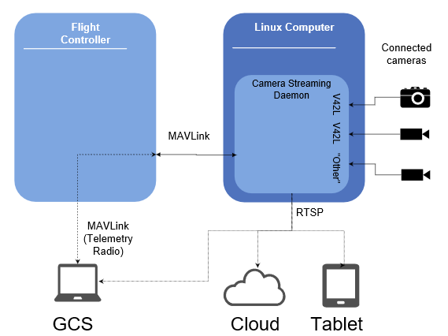

# Dronecode Camera Manager

The *Dronecoce Camera Manager* (DCM) is an extensible Linux camera server for interfacing cameras with the Dronecode platform. 

It provides a [MAVLink Camera Protocol](https://mavlink.io/en/protocol/camera.html) compatible API for video and image capture etc., and an RTSP service for advertising and sharing video streams. The server can connect to and manage multiple cameras, and has been designed so that it can be extended to support new camera types and protocols when needed. 

> **Tip** The DCM is the easiest way for Camera OEMs to interface with the Dronecode platform. Many cameras will just work "out of the box". At most OEMs will need to implement a camera integration layer.

## Overview

The diagram below shows the main components of a system that is running the *Camera Manager* on a Linux companion computer.

The server:

* Scans and attaches to all compatible cameras. Cameras that support the [Video4Linux (V4L2) API](https://linuxtv.org/downloads/v4l-dvb-apis/uapi/v4l/v4l2.html) work out of the box (the server can be extended to support other camera protocols/APIs).
* Advertises and shares RTSP video streams for all connected cameras. These can be consumed by the GCS and other video player services.
* Captures and stores/shares video and still images for all connected cameras via the [MAVLink Camera Protocol](https://mavlink.io/en/protocol/camera.html). GCS requests for camera actions are forwarded by PX4. 

> **Note** The *Camera Manager* also integrates with Gazebo, providing a simulated camera backend. In this case the diagram/configuration can be slightly different as the GCS can communicate directly with the server (there is no need for messages to be forwarded by PX4). 

## Prerequisites
In order to compile you need the following packages:

 - GCC/G++ compiler 4.9 or newer
 - C and C++ standard libraries
 - GLib 2.42 or newer (https://wiki.gnome.org/Projects/GLib)
 - GStreamer 1.4 or newer (https://gstreamer.freedesktop.org/)
 - GStreamer RTSP Server 1.4 or newer (https://gstreamer.freedesktop.org/modules/gst-rtsp-server.html)
 - Python2

### Installing Pre-Requisites on Ubuntu

The following commands should install many of these required packages on Ubuntu:

    $ sudo apt-get install gstreamer-1.0
    $ sudo apt-get install libgstreamer-plugins-base1.0-dev
    $ sudo apt-get install libgstrtspserver-1.0-dev
    $ sudo pip2 -q install -U future

## Fetch source-code and dependencies ##

Clone the repo:
     
    $ git clone https://github.com/Dronecode/camera-manager.git

We currently depend on mavlink C library which is generated by the build
system during compilation. The corresponding submodule should be fetched.

    $ git submodule update --init --recursive

## Build 

Build system follows the usual configure/build/install cycle. Configuration is needed to be done only once. A typical configuration is shown below:

    $ ./autogen.sh && ./configure

### Aero

Building for Aero requires Avahi 0.6 or newer (https://github.com/lathiat/avahi) which can be installed using:

    $ sudo apt-get install libavahi-client-dev libavahi-core-dev libavahi-glib-dev

In order to build for aero, use --enable-aero and --enable-realsense options along with ./configure:

    $ ./autogen.sh && ./configure --enable-aero --enable-realsense --enable-mavlink --enable-avahi

### Webcam: Ubuntu

In order to build for ubuntu use:

    $ ./autogen.sh && ./configure --enable-mavlink 

### Gazebo Camera: PX4-SITL Ubuntu

In order to build for ubuntu with PX4-SITL Gazebo:

    $ ./autogen.sh && ./configure --enable-mavlink --enable-gazebo
       

By default systemd integration is enabled. In a system without systemd it can
be disabled --disable-systemd. The default systemd system directory
is taken via pkg-config. To use another directory update the above
path, use --with-systemdsystemunitdir.

Build:

    $ make

## Run

It's possible to use a .conf file to set custom options for the Dronecode Camera Manager. By default, DCM looks for a file /etc/dcm/main.conf. File location can be overridden via DCM_CONF_FILE  environment variable, or via -c switch when running DCM. Sample conf file can be found on [samples/files](https://github.com/Dronecode/camera-manager/tree/master/samples/files)

### Aero

The dcm is a part of Intel Aero image, and is placed in /usr/bin. The conf file is placed in /etc/dcm.

 1) Make sure DCM is running on aero:

        $ systemctl status dcm

 2) To see the list of cameras connected to aero avahi-browse can be used provided avahi is enabled.

        $ avahi-browse -all | grep _rtsp._udp

### Webcam : Ubuntu

To run DCM on ubuntu with webcam connected:

 1) Start jmavsim.
      
        $ make posix_sitl_default jmavsim

 2) Open QGC build from master and connect to jMAVSim.

 3) Then close jMAVSim.

 4) Run dcm

        $ ./dcm -c ubuntu.conf

### Gazebo Camera : PX4-SITL Ubuntu

To run DCM on ubuntu along with gazebo PX4-SITL use:
 
 1) Open QGC app build from master branch

 2) Edit configuration file in PX4-Firmware_folder/posix-configs/SITL/init/ekf2/typhoon_h480
     
      -mavlink start -x -u 14556 -r 4000000

      +mavlink start -x -u 14556 -r 4000000 -f

      +mavlink start -x -u 24550 -f -o 34550

 3) Start PX4-SITL gazebo: In file PX4-Firmware_folder/posix-configs/SITL/init/ekf2/typhoon_h480

        $ make posix gazebo_typhoon_h480

 4) Run DCM with mavlink and gazebo enabled:

        $ ./dcm -c gazebo.conf

## Testing ##

### Video Streaming

Testing of video streaming can be done using a vlc player or a gstreamer client pipeline or a QGroundcontrol app.

   To test video streaming using vlc:

    $ vlc rtsp://<ip_dcm_running_system>:8554/videox

   To test video streaming using gstreamer client pipeline:

    $ gst-launch-1.0 uridecodebin uri=<ip_dcm_running_system>:8554/videox

   In order to test the video streaming using QGC, select RTSP Video Source in General Setting-> Video ->Video Source and fill in uri as rtsp://ip_dcm_running_system:8554/videox. Observe the video in video area in fly  view.

### Camera Control 

Testing camera control parameters requires mavlink enabled DCM, a QGC app build from master and a http server (Follow https://www.digitalocean.com/community/tutorials/how-to-install-linux-apache-mysql-php-lamp-stack-on-ubuntu-16-04 to install apache server).

 1) Host the camera definition file present in samples directory using http server. To host using apache server copy the file to /var/www/html:
 
        $ cp ~/camera-streaming-daemon/samples/camera-def-rs-rgb.xml /var/www/html

   The aero image has an aero-http server to host camera definition file. Copying the camera defenition files to /var/http will host the files.
   
 2) Update the uri section in conf file with appropriate ip adress. Sample conf files are present in files folder in samples directory.

 3) Open QGC build from master. Select General Settings->Video Source -> RTSP Video Stream. Fill in the video uri and observe the video in fly view. 

 4) In fly view, select camera from dropdown list located in top right corner under compass. Settings button in left top corner of the box can be used to set the control parameters of the camera.

### Image capture

   Testing image capture requires mavlink enabled DCM and a QGC app build from master.

 1) In QGC, disable the video streaming: General Settings->Video Source -> Video Stream Disabled.

 2) Create a directory to store the image and update the location in imgcap section of conf file.
   
 3) Now, in fly view of QGC app select camera mode and click on red button to take an image. The image will be stored in the location given in imgcap section in conf file.

## Sample

### Running the sample
In camera-streaming-daemon samples repository there is one sample to list all drone's video stream found.
The first step to build the samples:

    $ make samples

And then in a computer connected to the target drone using WiFi or any other Ethernet connection:

    $ ./samples/camera-sample-mavlink-client

More information about the camera-sample-mavlink-client is located in [[samples|Samples#camera-sample-mavlink-client]] wiki page.

## Contributing

Pull-requests are accepted on GitHub. Make sure to check coding style with the
provided script in tools/checkpatch, check for memory leaks with valgrind and
test on real hardware.

### Valgrind

In order to avoid seeing a lot of glib and gstreamer false positives memory leaks it is recommended to run valgrind using the followind command:
    $ GDEBUG=gc-friendly G_SLICE=always-malloc valgrind --suppressions=valgrind.supp --leak-check=full --track-origins=yes --show-possibly-lost=no --num-callers=20 ./dcm
